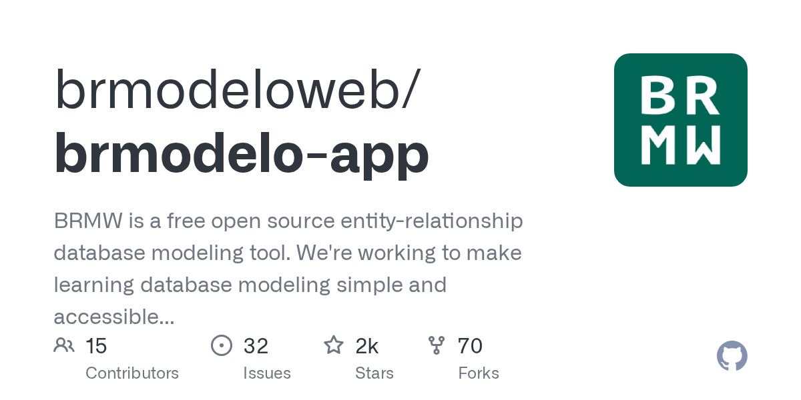

# Open Source

Índice público de contribuições em projetos **open source**.

Este repositório é uma **capa de portfólio**: documenta PRs, issues e contexto técnico. O código das contribuições fica nos repositórios **upstream** (e, durante o trabalho, no fork).

**Autor da capa:** [Mazer](https://github.com/lMazer) (`@lMazer`)

## Resumo

| Projeto | Stack | Status | Última alteração | Contribuição | Autor |
|---------|-------|--------|------------------|--------------|-------|
| BRMW | React 19, TypeScript, JointJS, Webpack | PR aberto (aguardando review) | 22/09/2026 | [#719](https://github.com/brmodeloweb/brmodelo-app/pull/719) | [Mazer](https://github.com/lMazer) (`@lMazer`) |
| BRMW | React 19, TypeScript, JointJS, Webpack | PR aberto (aguardando review) | 22/09/2026 | [#718](https://github.com/brmodeloweb/brmodelo-app/pull/718) | [Mazer](https://github.com/lMazer) (`@lMazer`) |
| BRMW | React 19, TypeScript, JointJS, Webpack | PR aberto (aguardando review) | 22/09/2026 | [#717](https://github.com/brmodeloweb/brmodelo-app/pull/717) | [Mazer](https://github.com/lMazer) (`@lMazer`) |
| BRMW | Angular (legado), Sass, i18n | PR aberto (acompanhamento) | 22/09/2026 | [#669](https://github.com/brmodeloweb/brmodelo-app/pull/669) | [Márcio Carvalho](https://github.com/Marcio-Carvalho27) (`@Marcio-Carvalho27`) |

## Cases

### BRMW

Contribuições e acompanhamento ao [brmodelo-app](https://github.com/brmodeloweb/brmodelo-app) (ferramenta livre de modelagem ER usada em cursos de banco de dados). Fonte oficial dos PRs: [`brmodeloweb/brmodelo-app`](https://github.com/brmodeloweb/brmodelo-app).

#### Personalização de campos FK (#569)

Permite nome livre na FK e escolha explícita da coluna PK de origem; corrige o SQL para `REFERENCES` usar a PK real da tabela de origem (não o nome local da FK). Empilhado sobre [#718](https://github.com/brmodeloweb/brmodelo-app/pull/718).

- **Autor:** [Mazer](https://github.com/lMazer) (`@lMazer`)
- **Stack:** React 19, TypeScript, JointJS (`@joint/core`), Webpack 5, pnpm
- **Entrega:** Nome customizado da FK + dropdown da PK de origem (`tableOrigin.columnName`); `REFERENCES` correto no DDL; preenchimento na conversão/link manual com fallback para modelos antigos
- **Destaques técnicos:** `tableOrigin.columnName` no `Column` / `ColumnForm`; sync em `conversor` e `logicEditor`; SQL via PK de origem
- **Upstream:** [`brmodeloweb/brmodelo-app`](https://github.com/brmodeloweb/brmodelo-app)
- **PR:** [#719](https://github.com/brmodeloweb/brmodelo-app/pull/719) *(aberto · aguardando review)* — título upstream: *Feat: personalização de campos FK (#569)*
- **Dependência:** ideal mergear [#718](https://github.com/brmodeloweb/brmodelo-app/pull/718) antes (este PR empilha os commits de tipos parametrizados)
- **Fixes:** [#569](https://github.com/brmodeloweb/brmodelo-app/issues/569)

#### Tipos de dados parametrizados (#712)

Adiciona tamanho/precisão a tipos variáveis (`VARCHAR(255)`, `DECIMAL(10,2)`), amplia o catálogo de tipos e preserva esses metadados na conversão conceitual → lógico / NoSQL e na geração SQL.

- **Autor:** [Mazer](https://github.com/lMazer) (`@lMazer`)
- **Stack:** React 19, TypeScript, JointJS (`@joint/core`), Webpack 5, pnpm
- **Entrega:** Campos estruturados `length` / `precision` / `scale` nos editores lógico, conceitual e NoSQL; formatador compartilhado no DDL e no diagrama; catálogo ampliado (`DECIMAL`, `TEXT`, `BIGINT`, `UUID`, …); modelos legados sem params continuam carregando
- **Destaques técnicos:** `dataTypes.ts` + `TypeParamsFields`; params em `Column` / `erd.Attribute` / rows NoSQL; `formatColumnType` no `sqlGenerator`
- **Upstream:** [`brmodeloweb/brmodelo-app`](https://github.com/brmodeloweb/brmodelo-app)
- **PR:** [#718](https://github.com/brmodeloweb/brmodelo-app/pull/718) *(aberto · aguardando review)* — título upstream: *Feat: parameterized data types (VARCHAR, DECIMAL, etc.)*
- **Fixes:** [#712](https://github.com/brmodeloweb/brmodelo-app/issues/712)

#### Cardinalidade, sync de FK e export (#706 / #386)

Restauração da edição de cardinalidade nos editores conceitual e lógico, sincronização de FK ao mudar 1:1/1:N (bloqueio de N:N com modal), import/export `.brmw.json` e geração SQL mais confiável. Inclui persistência de labels (`dirty` / `change:labels`) e scripts Windows com `cross-env`.

- **Autor:** [Mazer](https://github.com/lMazer) (`@lMazer`)
- **Stack:** React 19, TypeScript, JointJS (`@joint/core`), Webpack 5, pnpm
- **Entrega:** Seleção de links via `link:pointerclick` (conceitual e lógico); edição de cardinalidade com sync de FK/`NOT_NULL`/`UNIQUE`; import/export `.brmw.json` no workspace; SQL com `REFERENCES` pela PK real, copiar/baixar e validação; `setDirty` + `change:labels`; `cross-env` no Windows
- **Destaques técnicos:** `logicalCardinality` + sync de FK; `modelFileIO`; tools de link persistentes + InfoButton em links tabela–tabela
- **Upstream:** [`brmodeloweb/brmodelo-app`](https://github.com/brmodeloweb/brmodelo-app)
- **PR:** [#717](https://github.com/brmodeloweb/brmodelo-app/pull/717) *(aberto · aguardando review)* — título upstream: *Feat: cardinality editing, FK sync, and model export*
- **Histórico:** substitui o [#716](https://github.com/brmodeloweb/brmodelo-app/pull/716) *(fechado, não mergeado — fork recriado)*
- **Fixes:** [#714](https://github.com/brmodeloweb/brmodelo-app/issues/714), [#713](https://github.com/brmodeloweb/brmodelo-app/issues/713), [#386](https://github.com/brmodeloweb/brmodelo-app/issues/386), [#706](https://github.com/brmodeloweb/brmodelo-app/issues/706)
- **Related:** [#693](https://github.com/brmodeloweb/brmodelo-app/issues/693), [#626](https://github.com/brmodeloweb/brmodelo-app/issues/626), [#715](https://github.com/brmodeloweb/brmodelo-app/issues/715)

#### Dark mode (#669) — acompanhamento

Acompanhamento do PR aberto de dark-mode no BRMW.

- **Autor do PR (upstream):** [Márcio Carvalho](https://github.com/Marcio-Carvalho27) (`@Marcio-Carvalho27`)
- **Papel na capa:** Acompanhamento por [Mazer](https://github.com/lMazer) (`@lMazer`) — sem autoria do código do PR
- **Stack:** Angular (legado no PR), Sass, i18n
- **Upstream:** [`brmodeloweb/brmodelo-app`](https://github.com/brmodeloweb/brmodelo-app)
- **PR:** [#669](https://github.com/brmodeloweb/brmodelo-app/pull/669) *(aberto)* — título upstream: *feat: Adicionei a nova feature de dark-mode*

## Padrões que sigo

- Respeitar Code of Conduct e convenções do projeto upstream
- Preferir issues claras e reproduzíveis antes de abrir PR
- Branches `fix/`, `feature/` ou `enhancement/` a partir de `main`
- Commits com prefixo (`Fix:`, `Feat:`, `Docs:`, …) quando o projeto pedir
- Documentar na capa o link do PR, o status (aberto / mergeado / fechado) e o autor humano do GitHub
- Separar **Fixes** (issues que o PR fecha) de **Related** (contexto)
- Não listar ferramentas de IA como autor, coautor ou colaborador

## Como adicionar uma nova contribuição

Siga o template em [docs/ADDING_A_PROJECT.md](docs/ADDING_A_PROJECT.md).
